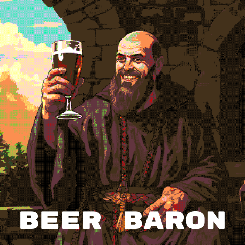

## **Beer Baron** - The Game Guide

An [dojo](https://github.com/dojoengine/dojo) onchain simulation masked as a beer brewing game. It is designed to work with 10 - 10,000 players.

### **Overview:**

In the game of Beer Baron, you step into the shoes of a monk with a flair for entrepreneurship. Hailing from an unknown Realm, your primary resource is a humble sum of 1000 gold. With this capital, you must use your abacus to navigate the hop market, grow hop flowers, brew beer, and sell it to the traverns to make a profit. The game is played over a period of 2 weeks, with the player with the largest fortune at the end of the game being crowned the winner.

*Game Loop:*
1. Buy hop seeds
2. Grow hop flowers
3. Brew Beer
4. Bottle beer
5. Sell beer

### **Novel Game Mechanics:**

- **Hop Market**: Hop market is based on a Logistic VRGDA
- **Farmland**: Farmland is limited, choose what you hop flowers to grow wisely.
- **Brewing**: Each beer recipe is unique blend of hop flowers
- **Selling**: The beer market is an inverse VRGDA, meaning the more you sell into it the cheaper it becomes. So it is best to brew the right beer and sell at the right time to maximise your profits.
- **Winning**: After 2 weeks the markets will close, the player with the biggest pile of Gold takes the entry fee.

### **Current Game Mechanics:**

1. **Hop Market**:
Logistic VRGDA auction dictates the price of the hop. Each hop type is sold on the Market and the price is driven by the VRGDA. The desired outcome of this is an extremly dynamic market, where the price of hops is constantly changing. This will force players to adapt their strategy to the market conditions.

2. **Farm land**:
Farm land is limited, and players must choose what hop flowers to grow wisely. Each farm can only grow one type of hop flower at a time. The hop flower will take time to grow, and will produce flowers. The hop flower can then be used to brew beer.

3. **Brewing**:
Different recipes for different beers. Each recipe requires a different combination of hop flowers. Starting beers:

- Dragonhide Blaze TIPA
- Mithral Haze Pale Ale
- Obsidian Imperial Stout

4. **Selling Beer**:
Sell your beer into the market to increase your gold. The beer market is an inverse VRGDA, meaning the more you sell into it the cheaper it becomes. Brew the right been and sell at the right time to maximise your profits.

5. **Winning**:
After 2 weeks the markets will close, the player with the biggest pile of Gold takes the entry fee.

### **To implement Game Mechanics**

1. **P2P Trading of Hop Flowers**:
Right now players cannnot trade Hop flowers, but this will be a key feature to implement, as it adds another way for players to make money and win.
 
2. **Dynamic Weather systems:**
Random weather events will affect the hop market, and the hop flower growth rate as well as influencing the beer market. No one wants to drink Stout in the summer!!


### Technology Stack:

- Dojo Engine
- React App
- RECs ECS library


### Other notable features:

- **Dynamic games**: Contracts have been designed to handle many games at once, and players can choose to modifiy the game parameters to suit their needs. Eg: Maybe you have 20 beer recipes and 30 different hop types, you can create a game with those parameters.
- **Game lobby**: Contracts include a basic Lobby system, where players can find games.
- **Optimistic client updates**: Where possible the game optimistically updates the client before resolving the transaction.


### Dojo World In detail

#### Systems

- `Buy Hops` : Buy hops from the VRGDA market
- `Game` : Game and Lobby logic
- `Start Beer Auction` : Start the beer auction
- `Start Hops Auction` : Start the hops auction
- `Build Farm` : Build a farm
- `Harvest Farm` : Harvest a farm
- `Brew Beer` : Brew a beer
- `Bottle Beer` : Bottle a beer
- `Sell Beer` : Sell beer to the market

#### Components

- `Auction` : Maintains the state of a VRGDA auction
- `TavernAuction` : Maintains the state of the Inverse VRGDA auction
- `GoldBalance` : Maintains the state of a players gold balance
- `ItemBalance` : Maintains the state of a players item balance (Hops, Beer, Flowers)
- `Brew` : Tracks brew batches
- `BrewBatchTrack` : Counts batches of beer
- `Game` : Tracks the state of a game
- `GameTracker` : Tracks number of games player in World
- `Player` : Tracks the state of a player per game
- `FarmArea` : Tracks the state of a farm

### TODO:

- Complete token logic
- Clean up logic
- Include burner wallet


### Launch the Example in Under 30 Seconds

Make sure you have dojo installed: 

- [Install Dojo](https://book.dojoengine.org/getting-started/quick-start.html)

We are currently using:

`dojoup -v nightly`

After cloning the project, execute the following:

1. **Terminal 1 - Katana**:

```console
cd contracts && katana --disable-fee --block-time 1000
```

2. **Terminal 2 - Contracts**:

```console
cd contracts && sozo build && sozo migrate
```

3. **Terminal 3 - Client**:

```console
cd client && yarn && yarn dev
```

Upon completion, launch your browser and navigate to http://localhost:5173/. You'll be greeted by the running example!